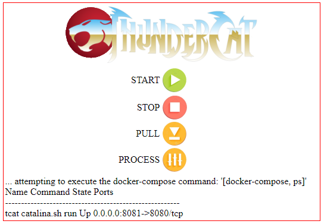

# thundercat
Start/Stop/Pull/Process for Docker-Compose

You aren't going to find anything fancy here - this is straight utilitarian software



Notes;
```
String directory = "/working/dir";
File out = new File(...); // File to write stdout to
File err = new File(...); // File to write stderr to
ProcessBuilder builder = new ProcessBuilder();
builder.directory(new File(directory));
builder.command(command);
builder.redirectOutput(out); // Redirect stdout to file
if(out == err) { 
  builder.redirectErrorStream(true); // Combine stderr into stdout
} else { 
  builder.redirectError(err); // Redirect stderr to file
}
Process process = builder.start();
```
